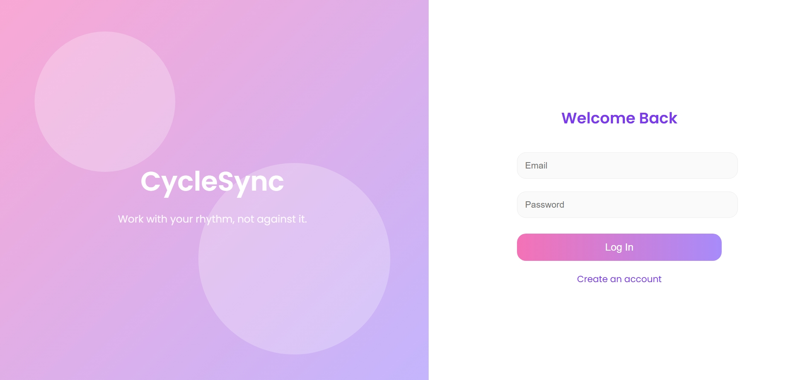
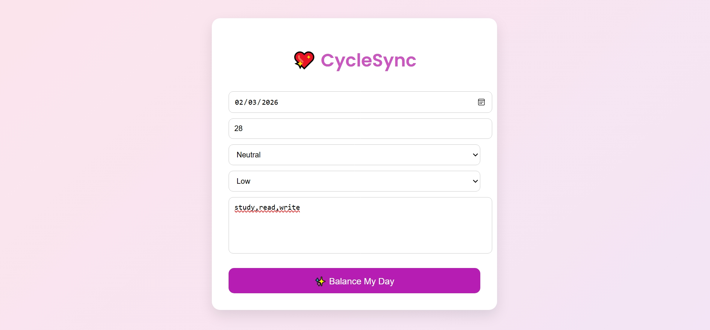
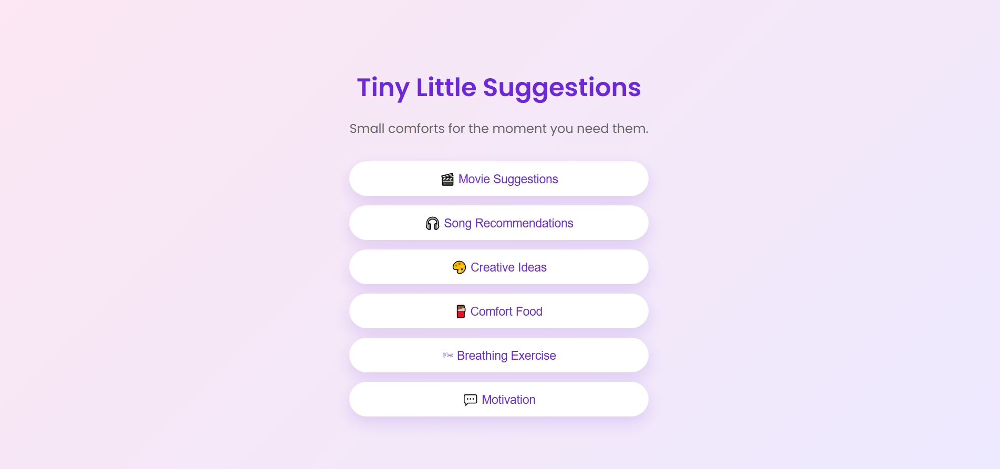

  

# CycleSync 

## Basic Details

### Team Name:
QubitX

### Team Members
- Member 1: Gouri B – Rajiv Gandhi Institute of Technology,Kottayam
- Member 2: Diya Shameer – Rajiv Gandhi Institute of Technology,Kottayam

### Hosted Project Link
[Add your deployed project link here]

---

## Project Description
CycleSync is a cycle-aware productivity and wellness assistant that adapts task suggestions and calming activities based on the user’s mood and biological rhythm. It helps users plan their day in a way that matches their energy levels instead of forcing rigid schedules.

---

## The Problem Statement
Traditional productivity tools assume that users have the same energy, focus, and motivation every day. However, biological cycles—especially menstrual cycles—affect mood, concentration, and productivity. This mismatch causes stress, burnout, and unrealistic expectations.

---

## The Solution
CycleSync analyzes user inputs such as mood, pain level, and cycle day, and then:
- Suggests suitable tasks
- Recommends calming activities
- Provides breathing exercises and motivational quotes

This creates a gentle, adaptive productivity experience.

---

## Technical Details

### Technologies/Components Used

**For Software:**
- Languages used:
  - HTML
  - CSS
  - JavaScript
- Frameworks used:
  - None 
- Libraries used:
  - Google Fonts (Poppins)
- Tools used:
  - VS Code
  - GitHub
  - Web Browser

**For Hardware:**
- Not applicable (Software-only project)

---

## Features

- Cycle-aware task suggestions
- Mood-based wellness recommendations
- Breathing exercise animation
- Motivational quote generator
- Aesthetic and calming user interface
- Multi-page user flow

---

## Implementation

### For Software:

#### Installation

## Project Documentation

### Screenshots

#### Login Page

#### Data Entry Page
  
User enters mood and cycle details.

#### Analysis Page
  
App provides analysis of data entry.

#### Suggestions Page
  
App provides calming and productivity suggestions.

---

## Diagrams

### System Architecture
  
Simple client-side architecture using HTML, CSS, and JavaScript.

### Application Workflow

*Workflow:*  
Users begin at the login page, enter their cycle and mood information, receive a phase-based analysis, and are then guided to personalized productivity and wellness suggestions.

git clone https://github.com/your-username/cyclesync.git
cd cyclesync

## AI Tools Used (Optional - For Transparency Bonus)

**Tool Used:** ChatGPT  

**Purpose:**
- UI styling suggestions
- Debugging JavaScript logic
- Page layout and navigation planning
- Generating small code snippets for features

**Key Prompts Used:**
- “Create a cycle-aware task planner UI”
- “Add breathing animation using JavaScript”
- “Design an aesthetic login page”
- “Connect pages using JavaScript navigation”

**Percentage of AI-generated code:**  
Approximately 50–60%

**Human Contributions:**
- Project idea and concept
- Architecture and user flow design
- UI/UX decisions
- Feature selection and integration
- Testing and presentation preparation

---

## Team Contributions

- Gouri B: Frontend design, UI styling, feature integration, and logic
- Diya Shameer: Page navigation, testing, debugging, and documentation

